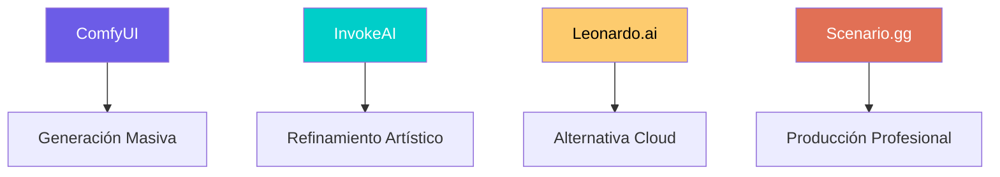

# Alternativas a ComfyUI — Estudio Comparativo

> Fecha: 2026-06-04
> Propósito: Evaluar herramientas complementarias para la fábrica de juegos SIMMOON

---

## 1. InvokeAI — 🖥️ Local / Self-hosted

### ¿Qué es?
Plataforma open-source de generación de imágenes con enfoque artístico.
Su principal fortaleza es el **Unified Canvas** para inpainting/outpainting.

### Instalación
```bash
# Opción recomendada: AppImage Launcher
wget https://github.com/invoke-ai/InvokeAI/releases/latest/download/InvokeAI-Installer.AppImage
chmod +x InvokeAI-Installer.AppImage
./InvokeAI-Installer.AppImage  # Sigue el asistente interactivo
```

### Requisitos
- GPU NVIDIA con 6GB+ VRAM (12GB+ recomendado)
- 16GB RAM mínimo, 32GB recomendado
- 50GB+ SSD para modelos

### Puerto por defecto: `http://localhost:9090`

### Comparativa vs ComfyUI

| Aspecto | InvokeAI | ComfyUI |
|---------|----------|---------|
| **Workflow** | Layer-based, UI Canvas | Node-based gráfico |
| **Audiencia** | Artistas, diseñadores | Developers, técnicos |
| **Uso principal** | Refinamiento artístico | Pipelines automatizados |
| **Curva de aprendizaje** | Baja-media | Alta |
| **API** | REST funcional | REST muy potente |
| **Batch processing** | Limitado | Excelente |

### Veredicto para SIMMOON
✅ **Complemento artístico ideal** — para refinar assets manualmente
❌ No reemplaza a ComfyUI para generación masiva automatizada

---

## 2. Leonardo.ai — ☁️ API Cloud

### ¿Qué es?
SaaS en la nube con API REST. Adquirido por Canva (Jul 2024).
API separada del plan web (créditos distintos).

### API
```bash
# Autenticación
Authorization: Bearer <API_KEY>

# Endpoint base
POST https://cloud.leonardo.ai/api/rest/v1/generations

# Parámetros clave
{
  "prompt": "isometric lunar colony building, pixel art style...",
  "modelId": "model-id",
  "width": 512,
  "height": 512,
  "alchemy": true,
  "ultra": true
}
```

### Características
- Modelos fine-tuneables por el usuario
- Webhooks para notificaciones async
- ControlNet integrado
- Feature "Get API Code" que genera boilerplate desde la UI

### Precios
- Pay-as-you-go por créditos API
- Sin suscripción mensual obligatoria
- Créditos separados del plan web

### Veredicto para SIMMOON
✅ **Sin GPU local** — ideal si no se quiere atar a la RTX 4070
❌ Datos en servidores externos, costo por uso

---

## 3. Scenario.gg — ☁️ API para Videojuegos

### ¿Qué es?
Plataforma especializada en generación de assets para videojuegos.
Su propuesta de valor: **consistencia de estilo** mediante fine-tuning.

### API
```bash
# Autenticación
Authorization: Bearer <API_KEY>

# Endpoint
POST https://api.scenario.com/v1/generations

# Parámetros
{
  "prompt": "lunar mining facility, top-down 2D tile",
  "modelId": "model-fine-tuned-on-art-bible",
  "negativePrompt": "...",
  "width": 512,
  "height": 512,
  "dryRun": false  # Estimar costo antes de ejecutar
}
```

### Características Clave
- **Custom Model Training**: Entrenas un modelo con tu art bible
- **Batch Processing**: Alto volumen automatizado
- **Asset Management**: API para gestionar assets generados
- **dryRun**: Estima costo antes de generar

### Precios
- Planes: Pro, Team, Enterprise
- Compute Units (sistema de créditos)
- Licencia comercial incluida en todos los planes de pago
- Eres dueño de los assets generados

### Veredicto para SIMMOON
✅ **Consistencia de estilo excepcional** — ideal si se entrena un modelo con el estilo SimCity 2000
❌ Plan profesional de pago, dependencia de nube

---

## 📊 Tabla Comparativa Final

| Necesidad | Mejor Opción | Por qué |
|-----------|-------------|---------|
| **Pipeline local automatizado** | 🏆 **ComfyUI** | Ya instalado, 7 runs generados |
| **Refinamiento artístico** | 🏆 **InvokeAI** | Unified Canvas, UI amigable |
| **API cloud sin GPU** | 🏆 **Leonardo.ai** | API robusta, pay-as-you-go |
| **Consistencia de estilo masiva** | 🏆 **Scenario.gg** | Fine-tuning + batch processing |
| **Lo que NO necesitas** | ~~A1111~~ ✅ Eliminado |

## 🎯 Recomendación para SIMMOON



**Paso 1:** Instalar InvokeAI como complemento artístico local
**Paso 2:** Explorar APIs de Leonardo.ai y Scenario.gg con prueba gratuita
**Paso 3:** Evaluar si la GPU local (RTX 4070) es suficiente o si se necesita cloud

---

*Documento creado: 2026-06-04 — Basado en investigación web de documentación oficial.*
